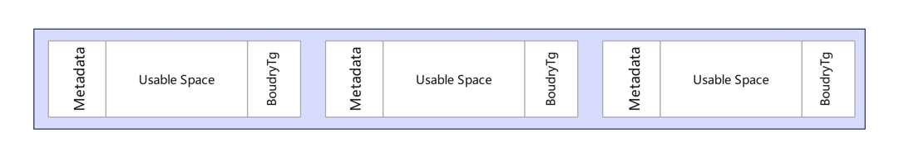

## 堆内存

### sbrk and brk

brk 通过增加程序中断位置(brk)从内核中获取内存（初始化非0）。一开始堆段的起始(start_brk)和结束(brk)都指向同一位置。

当 ASLR 关闭时，start_brk和brk将指向数据段 (end_data)的末尾
当ASLR打开时，start_brk和brk指向的位置即为数据段(end_data)的末尾地址加上随机brk偏移地址所指向的位置

sbrk() 系统调用在类Unix操作系统中用于增加或减少进程堆段的内存分配。当以参数 0 调用时，sbrk() 返回当前程序断点位置，即堆段结束的地址。


```c++
void *curr_brk, *tmp_brk = NULL;

printf("Welcome to sbrk example:%d\n", getpid());

/* sbrk(0) gives current program break location */
tmp_brk = curr_brk = sbrk(0);
printf("Program Break Location1:%p\n", curr_brk);
```


上述程序中的 sbrk(0) 调用返回指向当前程序断点位置的指针，然后使用 printf() 打印出来。注意，%p 格式说明符用于打印指针的值。

这在需要在堆上分配内存并跟踪已分配内存量的情况下非常有用。通过在每次分配之前和之后调用 sbrk(0)，程序可以通过两个值相减来确定实际分配了多少内存。


在内存管理的背景下，“break location”指的是进程数据段（堆）的边界或结束点。它代表动态内存分配的当前限制。

当程序运行时，需要内存来存储变量、数据结构和动态分配的内存（例如在C/C++中使用malloc()或new）。断点位置标记了已分配的内存空间的末端，并确定程序可以分配额外内存的位置。

通过使用诸如brk()或sbrk()之类的系统调用，程序可以调整断点位置，扩展或收缩可用于分配的内存量。当断点位置移动时，程序会相应地获得或释放内存。

因此，断点位置表示程序数据段的当前内存位置结束点，以及在需要时可以分配额外内存的位置。

### 分别使用sbrk和brk函数

首先是sbrk函数的例子：

```c
#include <unistd.h>
#include <stdio.h>

int main() {
void* ptr1 = sbrk(0);  // 获取当前堆区的末尾地址
printf("初始堆指针位置：%p\n", ptr1);

    int* int_ptr = (int*)sbrk(sizeof(int));  // 分配一个int大小的内存块
    if (int_ptr == (void*)-1) {
        perror("sbrk");
        return 1;
    }

    printf("分配的内存地址：%p\n", int_ptr);

    void* ptr2 = sbrk(0);  // 再次获取堆区的末尾地址
    printf("分配后堆指针位置：%p\n", ptr2);

    return 0;
}
```
现在让我们来看看brk函数的例子：

````c
#include <unistd.h>
#include <stdio.h>

int main() {
void* ptr1 = sbrk(0);  // 获取当前堆区的末尾地址
printf("初始堆指针位置：%p\n", ptr1);

    brk(ptr1 + sizeof(int));  // 将堆区的末尾地址扩展sizeof(int)个字节

    int* int_ptr = (int*)ptr1;  // 使用分配的内存块
    printf("分配的内存地址：%p\n", int_ptr);

    void* ptr2 = sbrk(0);  // 再次获取堆区的末尾地址
    printf("分配后堆指针位置：%p\n", ptr2);

    return 0;
}
````
## 地址随机化

我测试的时候为什么每次初始堆指针地址都是一样的，没有地址随机化吗

> 这是因为现代的操作系统通常会对堆地址进行一定的随机化，以增加程序的安全性。但是，这种随机化不是默认启用的，需要在编译选项中显式指定才能生效。
如果你想在测试中观察到堆指针地址的随机化效果，可以在编译时通过添加 -fPIE 或者 -pie 的选项来开启地址随机化。例如：
gcc -o test test.c -fPIE 这样就可以开启地址随机化，并在每次运行时观察到不同的堆指针地址了。

加上之后还是一样：
> 如果你在编译时加上了 -fPIE 或 -pie 选项，但是运行程序时仍然没有看到地址随机化的效果，那可能是因为你的操作系统默认不开启地址随机化。这种情况下，你可以尝试手动开启地址随机化。

以 Ubuntu Linux 为例，你可以通过以下命令来开启地址随机化：

sudo sysctl -w kernel.randomize_va_space=2
其中 kernel.randomize_va_space 参数表示地址随机化的级别，2 表示开启最高级别的地址随机化。开启后再运行程序，就应该可以看到堆指针地址的随机化效果了。

需要注意的是，开启地址随机化可能会对程序的调试和性能分析造成影响，因此在实际开发过程中需要权衡利弊。


如果你想在 Ubuntu Linux 上关闭地址随机化，可以使用以下命令：

sudo sysctl -w kernel.randomize_va_space=0

### 堆的管理

```c
void *tret;
char *pmem;

tret = sbrk(0);
if (tret != (void *)-1)
printf("heap start: %p\n", tret);

pmem = (char *)malloc(1);  // 分配内存
if (pmem == NULL) {
    perror("malloc");
    exit(EXIT_FAILURE);
}
printf("pmem: %p\n", pmem);

tret = sbrk(0);
if (tret != (void *)-1)
    printf("heap size on each load: %p\n", (long)tret - (long)pmem);

free(pmem);
```

运行结果如下：


问题： 为什么malloc不从sbrk(0)分配内存？

C语言中的malloc函数用于在堆上动态分配内存。它不保证从sbrk(0)返回的确切地址开始分配。

原因是malloc的实现通常需要以更高效的方式管理内存，例如对齐内存块或维护内部数据结构。因此，它可能向操作系统请求比实际所需的分配空间更多的内存。这样的额外内存可以用于未来的分配，避免了频繁调用sbrk()。

此外，malloc的实现可能采用不同的内存分配和释放策略，如使用分离的空闲链表、伙伴系统或其他技术。这些策略需要额外的记录信息，进一步影响了分配内存的起始地址。

总之，虽然sbrk(0)可以获取当前的程序断点，但malloc函数可能需要额外的内存进行管理，导致分配的内存不一定从该确切地址开始。


### naive malloc
```c
void* malloc(size_t size)
{
    // Ask the system for more bytes by extending the heap space.
    // sbrk returns -1 on failure
    void *p = sbrk(size);
    if(p == (void *) -1) return NULL; // No space left
    return p;
}
  void free() {/* Do nothing */}
```


上面是最简单的malloc实现，但是存在几个缺点。

系统调用比库函数调用要慢。我们应该预留一大块内存，并只在必要时向系统请求更多内存。

没有重复使用已释放的内存。我们的程序从不重用堆内存——它仅仅不停地请求更大的堆

###  heap management
在程序执行过程中，内存会被分配和释放，因此堆内存中会留下一些空隙，可以用于未来的内存请求。内存分配器需要跟踪哪些部分的堆当前已分配，哪些部分是可用的。

具体来说，当程序通过malloc等函数申请内存时，内存分配器需要记录下已分配的内存块的起始地址和大小。这样，在后续的内存分配请求中，分配器可以检查这些记录，找到合适大小的可用内存块，并返回给程序。

当使用free函数释放已分配的内存时，分配器则需要将该内存块标记为空闲状态，表示它可以被重复利用。同时，分配器可能会进行一些内存合并操作，将相邻的空闲内存块合并成一个更大的连续空闲块，以便提供更大的可用内存。

通过跟踪已分配和空闲的内存块，内存分配器可以有效地管理堆内存，避免内存碎片问题，并提供高效的内存分配和释放机制。这样可以优化内存利用率，减少对系统的频繁内存请求，提高程序的性能。


在给定一个新的malloc请求（malloc(2048)）时，malloc应该在哪里预留内存呢？它可以使用最后的2KiB空闲空间，正好是所需大小！或者，它可以分割其他两个空闲空间中的一个。这些选择代表了不同的内存分配策略。无论选择了哪个空间，分配器都需要将该空间分割成两部分：一个将返回给程序的新分配空间和一个较小的空闲空间（如果还有剩余空间）。一个完全适配（perfect-fit）策略会找到足够大小（至少2KiB）的最小空闲空间，然后将其分割成两部分。一个最差适配（worst-fit）策略会找到足够大小的最大空闲空间，然后将其分割成两部分。一个首次适配（first-fit）策略会找到第一个足够大小的可用空闲空间，然后将其分割成两部分。我们甚至不需要遍历整个堆！需要注意的是，这些分配策略不一定需要分割原有的块。例如，我们的首次适配分配器可以将原有的块返回而不做分割。但请注意，这会导致大约14KiB的空间被用户和分配器浪费。我们称之为内部碎片化（internal fragmentation）。

简单来说：

完全适配（perfect-fit）策略会找到刚好满足要求大小的最小空闲空间，并将其分割成两部分。

最差适配（worst-fit）策略会找到能够满足要求大小的最大空闲空间，并将其分割成两部分。

首次适配（first-fit）策略会从头开始，找到第一个能够满足要求大小的空闲空间，并将其分割成两部分。
这些策略会导致一定程度的内部碎片化，即用户和分配器无法充分利用已分配的内存空间，从而造成一些空间的浪费。


相比之下，外部碎片化是指尽管我们在堆中有足够的内存，但它可能被分割成一种方式，以至于无法获得连续大小的块。在我们之前的例子中，堆内存总共有64KiB，已经分配了17KiB，剩下47KiB是空闲的。然而，最大可用的块只有30KiB，因为我们可用的未分配堆内存被分割成了较小的片段。

换句话说，即使有足够的空闲内存总量，但由于空闲内存不连续分布，可能导致无法满足某些需要连续内存块的分配请求，从而浪费了一些可用内存空间。这就是外部碎片化的概念。

### 实现堆分配器


堆内存是一个由块组成的列表，每个块要么已分配，要么未分配。因此，在概念上，存在一个空闲块的列表，但它以每个块存储的块大小信息的形式隐含其中。让我们按照简单的实现来思考。

When a free block is found, it may be larger than the space we need. If so, we will create two entries in our implicit list. The first entry is the allocated block, the second entry is the remaining space. There are ways to do this if the program wants to keep the overhead small. We recommend first for going with readability

```c

typedef struct {
size_t block_size;
char data[0];
} block;

block *p = sbrk(100);
p->block_size = 100 - sizeof(*p)-sizeof(BTag);
```

// 其他块的分配

我们可以通过添加块的大小来从一个块导航到下一个块。


p + sizeof(metadata) + p->block_size + sizeof(BTag)
这样，我们就可以在堆中的块之间进行导航。通过使用指针算术，我们将当前块的起始地址加上当前块的大小和元数据的大小，就可以得到下一个块的起始地址。这样，我们可以在隐式列表的形式下从一个块跳转到另一个块。


调用程序不会看到这些值，它们是内存分配器实现内部的数据。举个例子，假设你的分配器被要求保留80个字节（malloc(80)），并且需要8个字节的内部头部数据。分配器需要找到至少88个字节的未分配空间。在更新堆数据之后，它会返回一个指向块的指针。然而，返回的指针指向可用空间，而不是内部数据！相反，我们会返回块的起始地址 + 8个字节。请记住，在实现中，指针算术依赖于类型。例如，p += 8 添加的是8个 sizeof(p) 的大小，而不一定是8个字节！